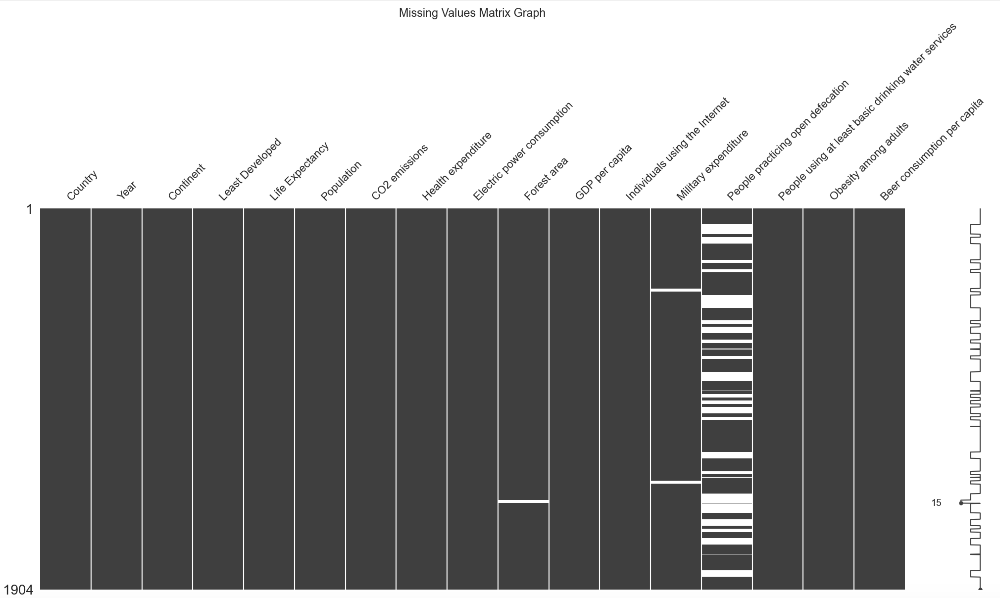
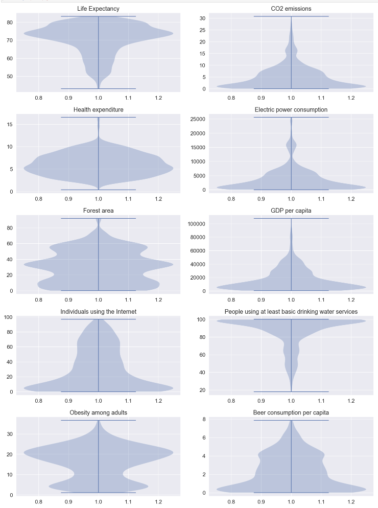
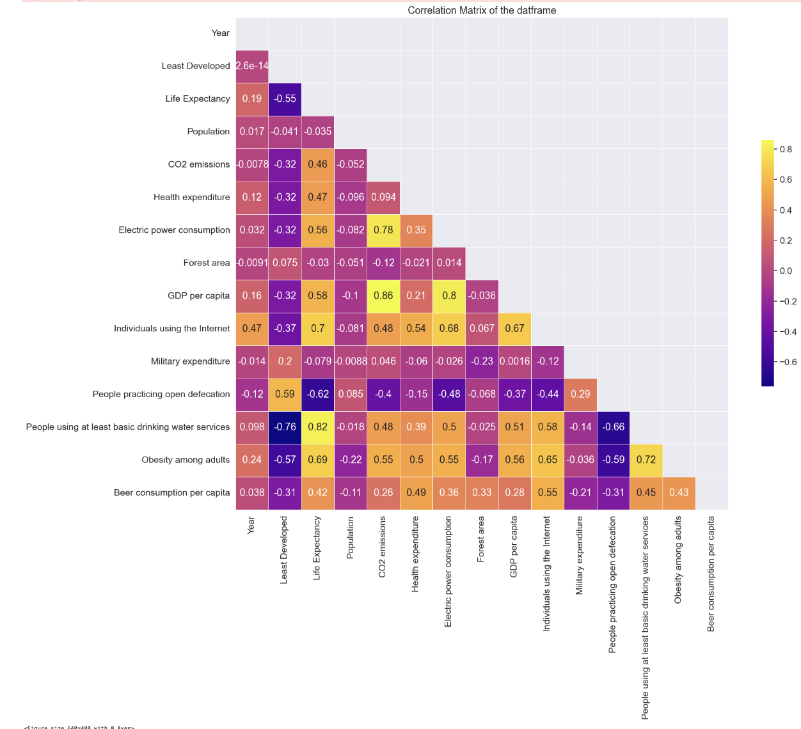
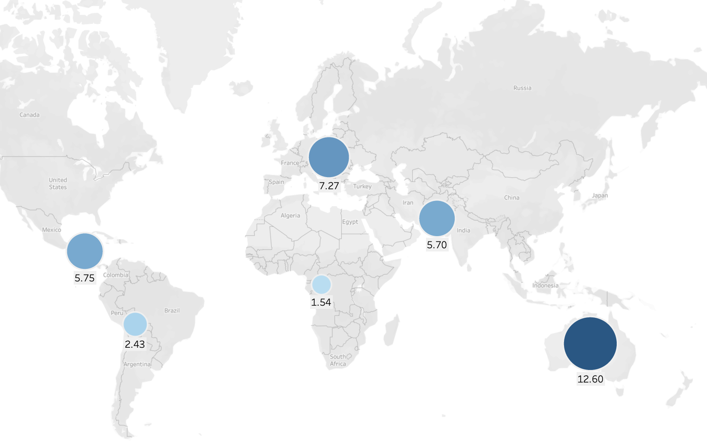
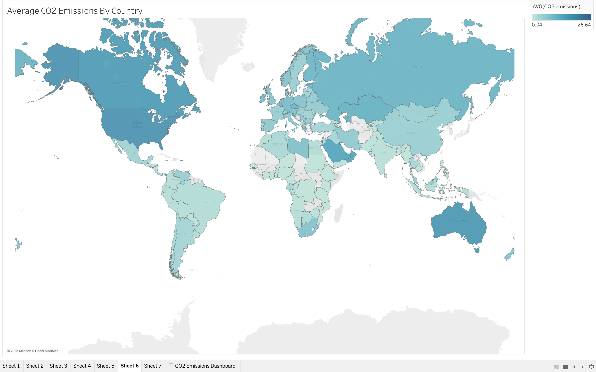

# Carbon Dioxide Emissions

## Introduction
Global warming is a pressing issue that poses a significant threat to the future of humanity. Extreme temperatures, both highs and lows, are just some of the adverse effects we've already experienced. Last year's heatwave served as a stark reminder of the dangers of global warming. Human-induced climate change is primarily caused by carbon dioxide emissions, making it imperative to explore the factors that influence these emissions. My aim is to determine the correlation between CO2 emissions and other variables to gain insight into this issue. To achieve this goal, I plan to use the seaborn & matplotlib library to plot various visualizations and pandas & numpy to wrangle the data to draw insightful conclusions.
## Exploratory Data analysis

I explored our dataset using various numpy and pandas functions like shape, describe and nunique. As part of the EDA we explored the missing values in dataset using, using the missing values matrix which can be seen below:

 

Looking at the graph above we can see there are a signficant number of missing values for the variable people practicing open defecation, which is understandable because this might be difficult to record.

Additionally, to understand the spread of variables, I made a violin plot for each of the variables. 

Looking at the graph above we can see that the variable Beer Consumption has the smallest spread, whereas, the variable GDP Per Capita has the biggest spread.

Next, we look at the relation between all the variables at a glance using the pairplot:

To understand the relation between all the variables better I then plotted a correlation matrix for the dataframe:

In the above correlation matrix we can see the correlation coefficiant of the all the variables in the dataframe.

## A Roadmap to a Greener Future: Understanding Factors Driving CO2 Emissions

I was first curious to know if there is a trend between the continents and carbon dioxide emissions. Is there continent that particularly stands out in terms of carbon dioxide emissions. 

In the above ridgeline plot, we have grouped the entries by continent, and we can observe that there are certainly some continents that have the higher carbon dioxide emissions than other. On one hand we can observe that on an average the continent of Oceania is one with highest carbon dioxide emissions, but that is becuase in the dataset there is only one country in the continent of Oceania. On the other hand, we can observe that the continent of Africa has the lowest carbon dioxide emissions.

Saying so, we must also note that what we discussed is averages, but continents like Asia display some anomalous behaviour as they have outliers. Even though, on an average, Asia is not the continent with the highest carbon dioxide emissions, one of the countries in Asia has the highest carbon dioxide emissions in the world.

We can see a more visually appealing presentation of the same through geo maps in tableau as presented below:

To understand the impact of geography on CO2 emmissions, we can see the CO2 emissions by country:

Another important factor that significantly impacts CO2 emissions is Electric Power Consumption

Here we can see positive correlation between the two factors - both electric power consumption and carbon dioxide emissions move in the same direction. Possibly due to the close connection between energy use and the generation of greenhouse gases, there is a positive correlation between CO2 emissions and electric power consumption. Energy use includes consumption of electric power, and when economies develop and grow, there is often an increase in the need for energy to run infrastructure, residences, and businesses. When fossil fuels like coal and oil, which are the main sources of electricity generation in many nations, are burned, the result is frequently a rise in CO2 emissions. 

The last factors that significantly impacts CO2 emisssions is GDP per capita:

 

Through the regression plot we can see that the relaiton between the two variable is close to a linear relation. Looking at the correlation matrix displayed earlier we can see the correlation coefficient is 0.828 which suggests a strong positive correlation between the two variables GDP per capita and carbon dioxide emissions. This correlation is possible attributed to the fact that as a country's economy grows, so does its energy consumption, which is often met by fossil fuels such as coal, oil, and gas that emit CO2.

#### Conclusion:
Based on the exploratory data analysis conducted we can conclude that that are numerous factors that influence carbon dioxide emissions. According to the analysis, there is a correlation between carbon dioxide emissions and continent, a country's level of development, how much electricity is used, and GDP per capita. The continent of Oceania stands out as having the largest carbon dioxide emissions, whilst Africa has the lowest emissions. Additionally, Carbon dioxide emissions are often higher in nations with higher levels of economic development and electric power usage. The investigation also revealed a strong positive association between GDP per capita and carbon dioxide emissions, which shows that carbon dioxide emissions increase with GDP per capita. Overall, the analysis suggests that countries' economic development and power consumption play the most crucial role in their carbon dioxide emissions.

To learn more about carbon dioxide emissions, you can find the full analysis notebook [here](https://github.com/kjassani/EDA_Carbon_Dioxide_Emissions/blob/main/EDA_CO2.ipynb), including the code and the data.

